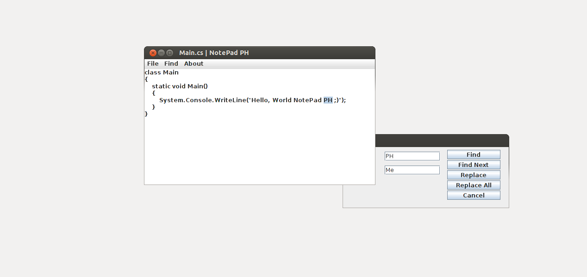

# Simple Java Text Editor

This is a simple text editor (notepad) written in Java. It also features a search engine.

If you use the executable file "notepad.jar" and that it does not run, you can type "java -jar /your_notepad_directory/notepad.jar" in your terminal.

## AUTHOR

### Base Application

Pierre-Henry Soria

### Modifications and Improvements

Achintha Gunasekara

## CONTACT

Pierre-Henry SORIA: pierrehenrysoria [AT] gmail [D0T] com

Achintha Gunasekara: contact@achinthagunasekara.com

## Important

**Icons directory and it's files must be present on the path when running the application**

## Demo

Download the Jar file and double click to run

Or run java -jar SimpleJavaTextEditor.jar from the command line

## LICENSE

Apache License, Version 2.0 or later; See the license.txt file in the notepad folder.
